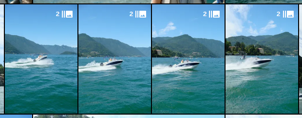
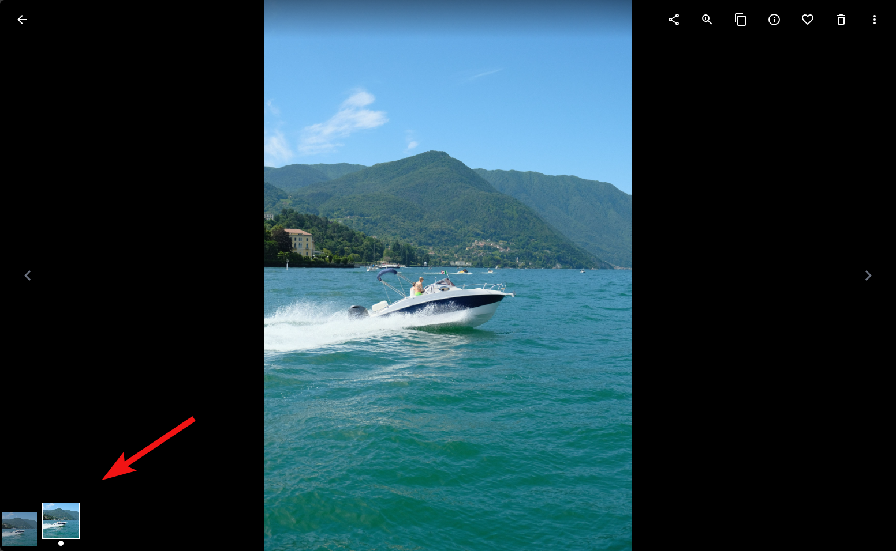
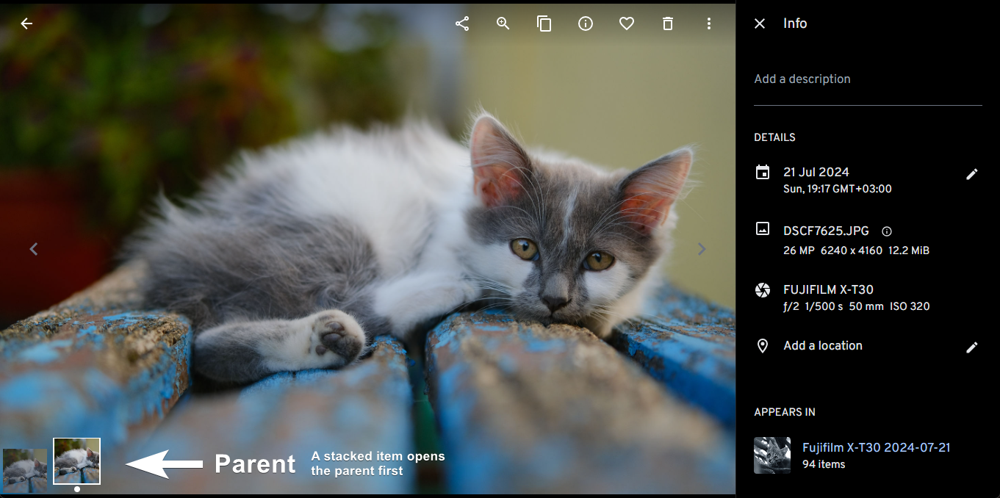
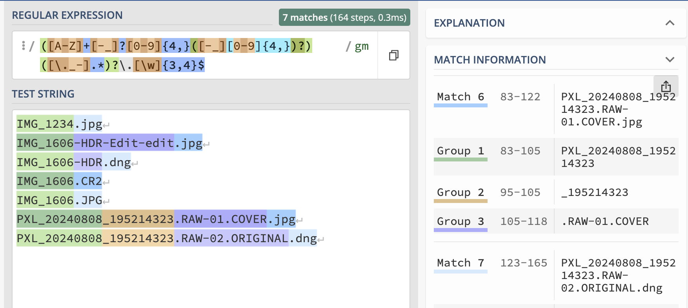

# Immich Auto Stack

<p align="center">
  
</p>

Immich has a stacking functionality. The act of stacking assets is not accessible through the UI thus most people aren't aware of it. Stacking is only accessible via the API at the moment.

This is a simple, yet highly configurable Python script, dressed as a Docker container, that stacks together photos, based on certain criteria.

<p align="center">
  
</p>

⚠️ By default, it stacks together only **JPG + RAW** files, taken on digital cameras. This behavior can be altered by using a [custom stacking criteria](#-customizing-the-stacking-criteria).

✨ Huge thanks to [@m3brown](https://github.com/m3brown) for adding a comprehensive stacking criteria!

## 🔵 Running it

The script can be run manually, or via cronjob by providing a crontab expression to the container. The container can be added to the Immich compose stack directly.

### 🔷 Obtaining an Immich API key
Instructions can be found in the Immich docs - [Obtain the API key](https://immich.app/docs/features/command-line-interface#obtain-the-api-key)

### 🔷 Running once
To perform a manually triggered run, use the following command:

```bash
docker run --rm -e API_URL="https://immich.mydomain.com/api/" -e API_KEY="xxxxx" -e SKIP_PREVIOUS=True ghcr.io/tenekev/immich-auto-stack:latest /script/immich_auto_stack.py
```

### 🔷 Running on a schedule
```bash
docker run --name immich-auto-stack -e TZ="Europe/Sofia" -e CRON_EXPRESSION="0 * * * *" -e API_URL="https://immich.mydomain.com/api/" -e API_KEY="xxxxx" -e SKIP_PREVIOUS=True ghcr.io/tenekev/immich-auto-stack:latest
```

### 🔷 Running as part of the Immich docker-compose.yml
Adding the container to Immich's `docker-compose.yml` file:

```yml
version: "3.8"
...
services:
  immich-server:
    container_name: immich_server
  ...

  immich-auto-stack:
    container_name: immich-auto-stack
    image: ghcr.io/tenekev/immich-auto-stack:latest
    restart: unless-stopped
    environment:

      # This is default. Can be omitted. 
      API_URL: http://immich_server:3001/api

      # https://immich.app/docs/features/command-line-interface#obtain-the-api-key
      API_KEY: xxxxxxxxxxxxxxxxx

      # This is default. Can be omitted. When true, prints output but does not submit any changes
      DRY_RUN: False

      # Whether or not to modify photos that are already in stacks. Going over all assets takes a lot more time.
      SKIP_PREVIOUS: True

      # This is default. Can be omitted. Read further for customization.
      # CRITERIA: '[{"key": "originalFileName","split": {"key": ".","index": 0}},{"key": "localDateTime"}]'
      # You can also break this into a multi-line string for better readability
      # CRITERIA: >
      #   [
      #     {
      #       "key": "originalFileName",
      #       "split": {
      #         "key": ".",
      #         "index": 0
      #       }
      #     },
      #     {
      #       "key": "localDateTime"
      #     }
      #   ]

      # This is default. Can be omitted. If you want to promote other parent criteria like "HDR" or "Edit".
      # PARENT_PROMOTE: ""
      
      # This is default. Can be omitted. Consider setting to true if you have a CRITERIA regex that
      # is not intended to match all the photos in your library.
      # SKIP_MATCH_MISS: False

      # Run every hour. Use https://crontab.guru/ to generate new expressions.
      CRON_EXPRESSION: "0 */1 * * *"
      TZ: Europe/Sofia
```

You can still trigger the script manually by issuing the following command inside the container shell. It will read any relevant environmental variables set during creation.
```sh
/script/immich_auto_stack.py
```
Or with Docker exec:
```sh
docker exec -it immich-auto-stack /script/immich_auto_stack.py
```

## 🔵 Parent priority

By default, `jpg`, `jpeg`, and `png` files are prioritized to be the parent. The parent is the first asset in a stack and it's the one to show first when you click on a stacked item in your timeline.

The defaults are `jpg`, `jpeg`, and `png` because they often contain the finished image. That is especially true for systems that add filters/recipes/in-camera edits or simple profile corrections, on top of the final image.

<p align="center">
  
</p>

Keywords can be provide additional weight to files when sorting. Maybe you performed an edit that should show first or there is an HDR version of the image. For example:

```shell
docker -e PARENT_PROMOTE="edit,crop,hdr" ...
```

This will sort like this:

```txt
IMG_1234_hdr_crop.jpg   # score -102
IMG_1234_crop.jpg       # score -101
IMG_1234.jpg            # score -100
IMG_1234_edit_crop.raw  # score -2
IMG_1234.raw            # score 0
```

## 🔵 Customizing the stacking criteria

### 🔷 The defaults

Configurable stacking criteria allows for the customization of how files are grouped.
The default in pretty json is:

```json
[
  {
    "key": "originalFileName",
    "split": {
      "key": ".",
      "index": 0 // this is the default
    }
  },
  {
    "key": "localDateTime"
  }
]
```

Functionally, this JSON config transforms to the following.

```python
lambda x: (
  x["originalFileName"].split(".")[0],
  x["localDateTime"]
)
```

The first criteria is the filename without the extension. The second criteria is the datetime of creation. This criteria aims to stack RAW+JPG images from cameras. By stripping the extension you get identical name and datetime that determine a stack.

### 🔷 Basic customization of the criteria

To override the default, pass a new criteria by using the CRITERIA env var.

```shell
# From
docker -e CRITERIA='[{"key": "originalFileName", "split": {"key": ".", "index": 0}},{"key": "localDateTime"}]' ...
# To
docker -e CRITERIA='[{"key": "originalFileName", "split": {"key": "_", "index": 0}}]' ...
```

This is the equivalent of:

```python
lambda x: (
  x["originalFileName"].split("_")[0]
)
```

### 🔷 REGEX customization of the criteria

The parser also supports regex, which adds a lot more flexibility.
The index will select a substring using `re.match.group(index)`. For example:

```json
[
  {
    "key": "originalFileName",
    "regex": {
      "key": "([A-Z]+[-_]?[0-9]{4}([-_][0-9]{4})?)([\\._-].*)?\\.[\\w]{3,4}$",
      "index": 1 // this is the default
    }
  },
  {
    "key": "localDateTime"
  }
]
```

A graphical representation of what this REGEX filter does. More can be generated at https://regex101.com.

<p align="center">
  
</p>

By default, any regex provided are assumed to match all image files and will throw an exception if
a single file does not match the regex. If the regex is not intended to match all files, the SKIP_MATCH_MISS
flag can be used to filter out files that do not match the regex pattern.

```shell
docker -e SKIP_MATCH_MISS=true ...
```

This can be useful if you can't come up with a single regex to satisfy all of your photos. SKIP_MATCH_MISS
would enable you to run multiple passes with multiple different regex patterns.

## 🔵 Custom criteria examples

### 🔷 Stack criteria based on filename only: 
Maybe your desired stack items were scattered through time. Beware with images from digital cameras - the count rolls over at 9999 and you end up with duplicate filenames in the long run.
```json
[
  {
    "key": "originalFileName",
    "split": {
      "key": ".",
      "index": 0 // this is the default
    }
  }
]
```
### 🔷 Stack criteria based on date & time only:
Won't work for bursts.
```json
[
  {
    "key": "localDateTime"
  }
]
```
### 🔷 Stack criteria based on date only:
This won't work very well on its own. In combination with `"originalFileName"` it can stack a sequence that for some reason does not have the same timecode.
```json
[
  {
    "key": "localDateTime",
    "split": {
      "key": "T",
      "index": 0
    }
  }
]
```
### 🔷 Stack criteria for filenames that may contain other keywords:
Like RAW, ORIGINAL, EDIT. It picks out only the initial image sequence. More can be read in issue #1.
```json
[
  {
    "key": "originalFileName",
    "regex": {
      "key": "([A-Z]+[-_]?[0-9]{4}([-_][0-9]{4})?)([\\._-].*)?\\.[\\w]{3,4}$",
      "index": 1
    }
  }
]
```
### 🔷 Multiple stack criterias:
Like the above but now the secondary criteria limits the stack to a specific date (not datetime, note that the timecode is also split).

⚠️ The order of the criteria matters! in this example, primary criteria is filename, secondary is date.
```json
[
  {
    "key": "originalFileName",
    "regex": {
      "key": "([A-Z]+[-_]?[0-9]{4}([-_][0-9]{4})?)([\\._-].*)?\\.[\\w]{3,4}$",
      "index": 1
    }
  },
  {
    "key": "localDateTime",
    "split": {
      "key": "T",
      "index": 0
    }
  }
]
```

### 🔷 Stacking by other keys:
There aren't that many other keys that can be used as a stacking criteria because they are either unique or not as consistent as `originalFileName` and `localDateTime`. Regardless, here are some of them - `thumbhash`, `fileCreatedAt`, `fileModifiedAt`.

 - `thumbhash` is mostly consistent when you want to stack duplicates instead of deleting them. It's mostly consistent when stacking RAW+JPG but not always.
- `fileCreatedAt`, `fileModifiedAt` can be unique for each file, preventing reliable stacking.

You can see all available keys for an asset by editing the URL to get to the API entry for it:

```
https://your-immich.tld/photos/00000000-0000-0000-0000-000000000000

https://your-immich.tld/api/assets/00000000-0000-0000-0000-000000000000
```
### 🔷 Stacking by EXIF data:
Initially this script relied entirely on the EXIF portion of the asset data.
Unfortunately, not all assets have EXIF data available and even if they did, most of it isn't appropriate for stacking. Thus stacking by EXIF data was replaced by more widely available properties.

## 🔵 Running tests
```sh
docker build -f Dockerfile.test -t immich-auto-stack-pytest .
docker run immich-auto-stack-pytest
```

## License

This project is licensed under the GNU Affero General Public License version 3 (AGPLv3) to align with the licensing of Immich, which this script interacts with. For more details on the rights and obligations under this license, see the [GNU licenses page](https://opensource.org/license/agpl-v3).

